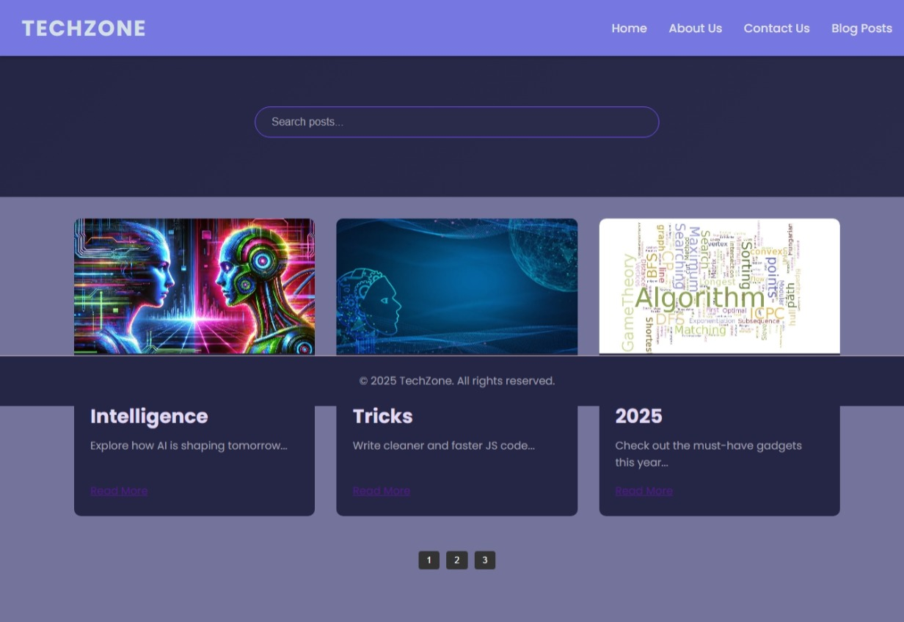

# 📝 Simple Blog Website
A minimal and responsive blog website built using HTML, CSS, and JavaScript. It features a homepage with blog post previews, individual post pages, a dynamic search/filter function, and smooth CSS animations.

# ✨ Features
## 📄 Homepage listing blog posts

## 🔗 Individual HTML pages for each post

## 🔍 JavaScript search & filter functionality

## 📱 Fully responsive layout

## 🎨 Basic CSS transitions and animations

## 🛠 Tech Stack
HTML5

CSS

JavaScript (Vanilla)

## 📌 Screenshot 1

---

## 📌 Screenshot 2

